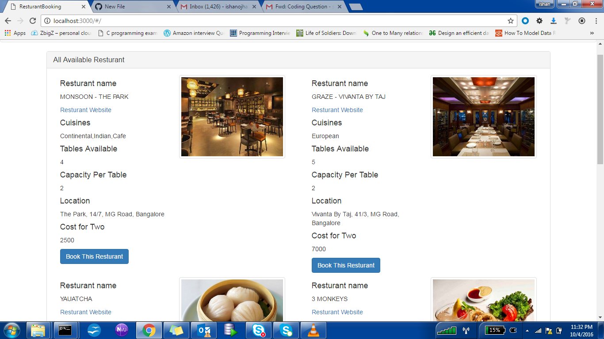
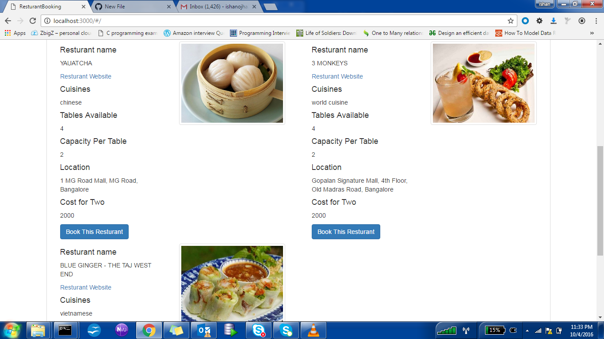
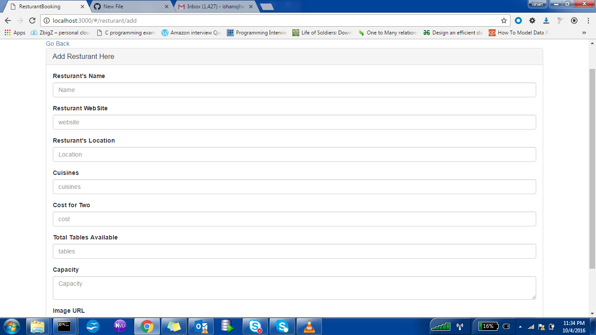
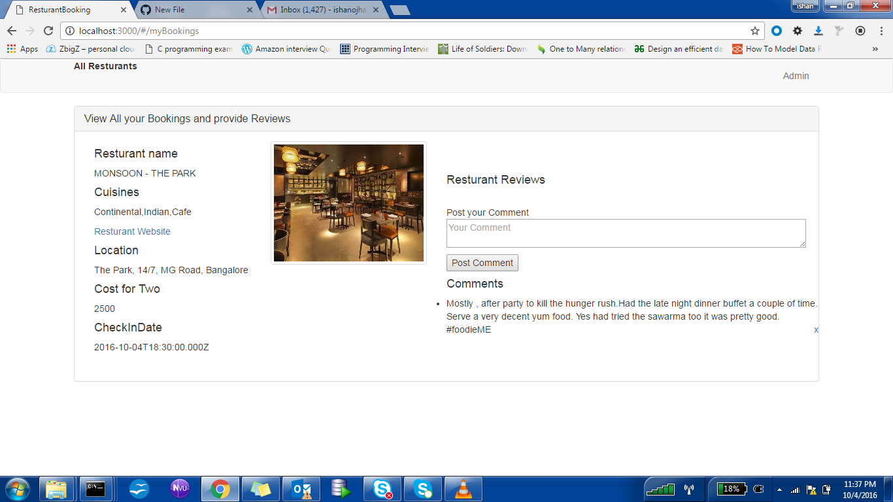

# zomato
MEAN stack web application where you can book your resturant , see all available resturant and filter them by name and location.

you can Search Restaurants by name/location/cuisines
Search for table by capacity for a given Restauant  
Book a table/Cancel a reservation.
Write reviews on experience

As admin you can Onboarding new restuarants 
Adding/Removing restuarants
Add remove tables to restuarant
Modify capacity/availability of a specific table
Get bookings for a table by time range

please refer screenshot of appliction:

